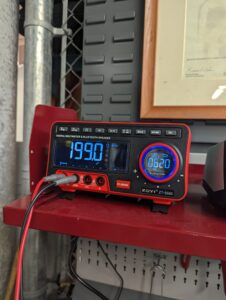
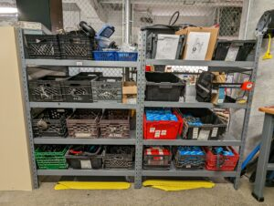
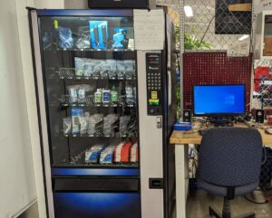
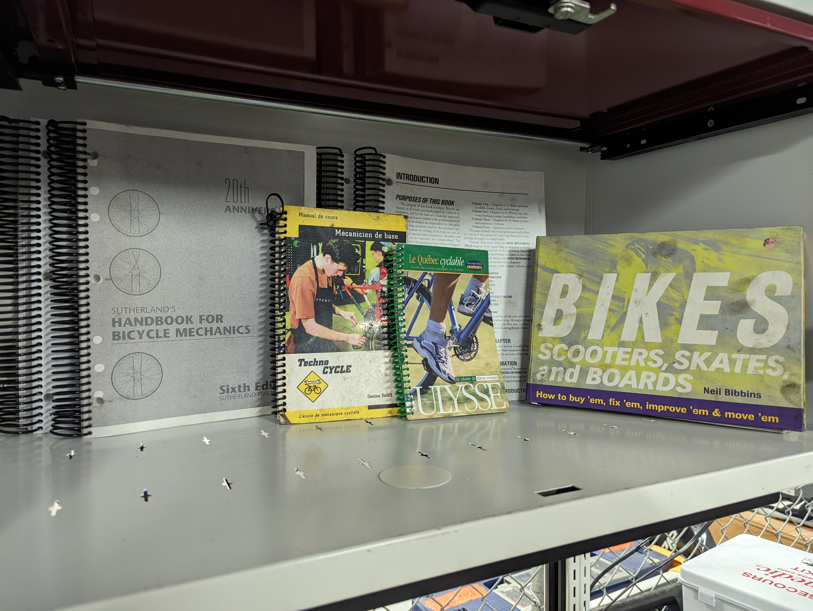

L'atelier du CRABE regorge de fonctionnalité.

## Partie mécanique
Nous avons essayé de réaliser l’atelier le plus complet possible. Vous y trouverez tous les essentiels d’une caisse à outils, mais également une grande sélection d’outillage spécialisé.

{width=50% height=auto}

## Partie électrique
Les temps changent et les vélos aussi ! Pour suivre leur évolution et que les étudiants puisse bricoler eux-mêmes leur vélo électrique, nous nous sommes équipés en conséquence. À votre disposition, fer à souder, multimètre, alimentation de laboratoire et bien d’autres !

## Pièces neuves et d'occasions
Que ce soit de la maintenance préventive ou une réparation, vous trouverez peut-être votre bonheur dans notre inventaire. Nous proposons une collection de pièces détachées d’occasion que nous recyclons au cours de l’année. Nous vendons également des pièces neuves comme des patins de frein, câbles, gaines, chaînes, pneus, etc.

## Documentation et poste de travail
Le CRABE est certes un atelier, mais surtout un lieu d’apprentissage. Il y a à votre disposition des guides et manuels sur le vélo en tout genre.

Un ordinateur est également là pour vos recherches internet. Il dispose d’Ansys et de Solidworks pour concevoir et dimensionner des pièces pour vos projets, que vous pourrez par la suite faire imprimer en PLA, ASA ou PETG via notre imprimante.

## Abonnez-vous !

Vous aimez ce que nous proposons ? Envie d’accéder à notre atelier de vélo et de participer dans la mobilité durable ? Achetez un abonnement ! Pour un prix abordable, vous profitez de nos installations tout en soutenant un club étudiant engagé. Visitez https://www.zeffy.com/fr-CA/ticketing/ca63464e-f124-451e-983b-8e03c13ce612 pour acheter votre abonnement !*

Vous souhaitez faire un tour de notre atelier ? Écrivez-nous à : crabe@ens.etsmtl.ca.

* Abonnement offert seulement aux membres de la communauté de l’École de technologie supérieure.
